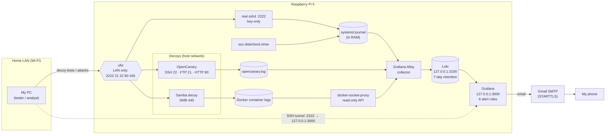

# Architecture

## Components in two sentences each

| Component | What it does | Why this way |
|---|---|---|
| **OpenCanary** | Fake SSH, FTP and HTTP-login services that log every touch as JSON. | Emulated services with no real accounts to break into. It starts as root to bind low ports, then drops to `nobody` with no capabilities. |
| **Samba decoy** | A real Samba server with one read-only bait share, built from Debian (no third-party image). | OpenCanary's SMB module needs Samba plus rsyslog. Logging Samba's JSON audit straight to stdout was simpler and kept rsyslog off the Pi. |
| **real sshd** | The only real way in: key-only, port 2222, LAN only. | Port 22 is the decoy, so scanners hit the trap first. |
| **ufw** | Default deny inbound; only 2222 and the decoy ports, only from the LAN (IPv4 and IPv6 link-local). | Docker-published ports bypass ufw, so every published port is bound to 127.0.0.1 on purpose. |
| **Grafana Alloy** | Reads the journal, the OpenCanary log and container logs, labels them, and pushes them to Loki. | Runs as an unprivileged user in the `systemd-journal` group, and never touches the Docker socket directly. |
| **docker-socket-proxy** | Lets Alloy list containers and read their logs, and refuses every other Docker API call. | Direct access to `docker.sock` is effectively root on the host, and Alloy handles attacker-written text. |
| **Loki** | Stores the logs on the SD card for 7 days. | Logs only, no metrics database: the one number needed (disk usage) is logged as a line and parsed. |
| **Grafana** | Dashboards and the 6 alert rules, which email me through Gmail. | Bound to 127.0.0.1 and reached through an SSH tunnel, so it's never on the family LAN. |

## Network exposure

| Port | Service | Reachable from |
|---|---|---|
| 2222/tcp | real sshd | LAN (ufw) |
| 21, 22, 80/tcp | OpenCanary decoys | LAN (ufw) |
| 445/tcp | Samba decoy | LAN (ufw) |
| 3000/tcp | Grafana | 127.0.0.1 only (SSH tunnel) |
| 3100/tcp | Loki | 127.0.0.1 only |
| 12345/tcp | Alloy debug UI | 127.0.0.1 only |

No NetBIOS (137–139): the SMB decoy never advertises itself, it only listens.
Nothing is reachable from outside the home network. There's no port forwarding and no router access.

## Hardening choices

- **Pinned image versions** for every container. Grafana's automatic plugin downloads are switched off, so nothing new runs unless I change a version.
- **Memory limits** on every container (this needed `cgroup_enable=memory` on the Pi's kernel command line).
- **Least privilege:** `cap_drop: ALL`, plus only the capabilities each container needs, and `no-new-privileges` everywhere.
- **Email alerts from a throwaway Gmail account**, so if the Pi is compromised, its app password can't reach my real inbox.
- **Secrets only in `.env`** (gitignored). `.env.example` holds placeholders.

## Boot sequence

The Pi has no RTC battery and is switched off every night. At boot, the clock is restored from the last
saved time, which can be hours stale, until NTP syncs. Events logged before that would carry old timestamps
and fall outside the alert rules' "last few minutes" windows. So:

1. `systemd-time-wait-sync` waits for NTP (capped at 2 minutes so a Wi-Fi outage can't block boot forever).
2. Docker starts after `time-sync.target`, and all containers come up with `restart: unless-stopped`.
3. Alloy uses `local.file_match` to wait for OpenCanary's log file, which can appear after Alloy starts.
4. OpenCanary's `/run` is a tmpfs, so a stale `twistd` PID file can't block it on restart.
